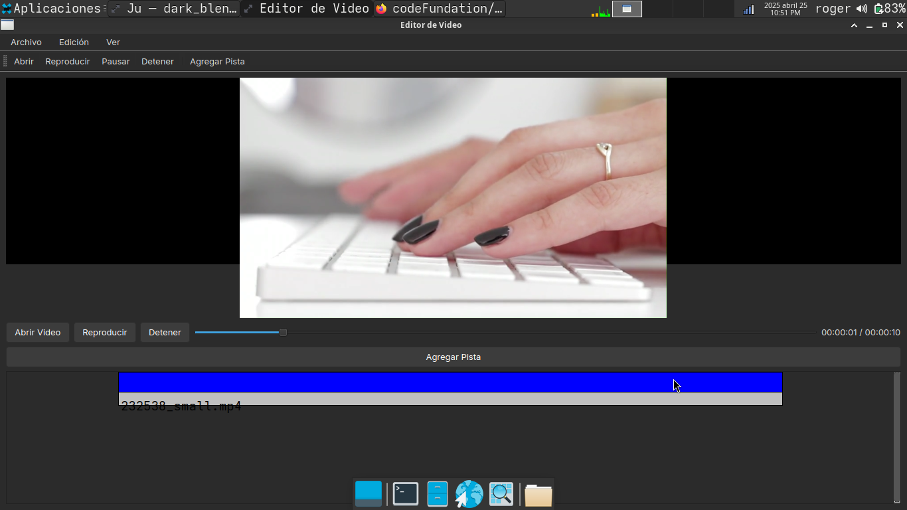

# Editor de Video Qt

Este es un proyecto de editor de video básico creado con C++ y Qt5.

## Requisitos

- Qt5 (con módulos `multimedia` y `multimediawidgets`)
- qmake
- g++

## Instalación

1. Clona el repositorio:

```bash
git clone https://github.com/tu_usuario/editor-video-qt.git
cd editor-video-qt
mkdir build && cd build
qmake ..
make
./miProyectoQt
```
## Mejoras Por Hacer
- Mejorar la interfaz
- mejorar el sistema de timeline, (linea del tiempo)
- mejorar las funciones

# Proyecto actual

